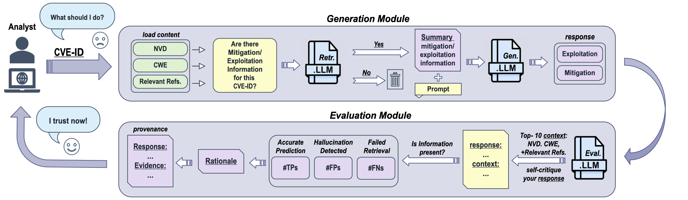

# ProveRAG
ProveRAG: Provenance-Driven Vulnerability Analysis with Automated Retrieval-Augmented LLMs

[arxiv](https://arxiv.org/abs/2410.17406)  

## Overview

This repo offers ProveRAG, an LLM-powered framework that emulates an analyst’s approach to vulnerability analysis while self-critiquing its own responses with evidence. By integrating a summarizing retrieval technique of up-to-date web data and a self-critique mechanism, ProveRAG reveals and alleviates the omission and hallucination problem of state-of-the-art LLMs. 



## Setup
Create a virtual environment and install the libraries:

```sh
python -m venv .venv
source .venv/bin/activate  # On macOS/Linux
.venv\Scripts\activate  # On Windows
pip install -r requirements.txt
```

## How to Run

Run the `main.py` file by passing the following arguments (you can select any OpenAI models here):
```python
 api_key = "YOUR_API_KEY"  # Replace with your OpenAI API key
 model_name = "gpt-4o-mini"
 data_path = './data/cve_2024_critical_hyper.csv'
 eval_type = "mitigation"  # or "exploitation"
 mode = "ProveRAG"  # or "ProveRAG-Aqua"

```

To use Open-Source Models, you need to run the files in the following order:

 `Ollama_relevancy.py  -> Ollama_generation.py -> Ollama_provenance.py`

Important Note: Some post-processing may be required before running these scripts to ensure the data is in the correct format. This is especially important if the LLM you're using does not support function calling. You might need to manually adjust the data or implement additional code to prepare it for these scripts.

## Repository Structure

### Data Folder
`cve_2024_critical_hyper.csv`
The curated dataset of CVEs in 2024 with critical vunlerability (up until July 25)

`baseline.py` 

This is the baseline file of directly prompting the GPT models about a specifc CVE.

`generation.py`

This file represents the Generation Module of the proposed ProveRAG framework. The Retr. LLM will summarize the content of the sources with respect to the exploitaion/mitigation information and then will pass it to the Gen. LLM to provide the response. 

`evaluation.py` 

This file represents the Evaluation Module of the proposed ProveRAG framework. The Eval. LLM will self-critique its response with verifiable sources be predicting a value (TP/FP/FN), rationale for the selected value, and provenance by showing pieces of text where it got the information (or where it hallucinated or omitted information). 

`classification_performance.py` 

This file represents the predicted number of TPs, FPs, and FNs for a selected model for ProveRAG.

`relevancy_count.py`

This file contains the number of relevant CVEs for each reputable source predicted by the LLM (shown in Table 2 of the paper).

`provenance_quality.py`

This file will use Embedding Similarity and Rouge-L metrics to assess the quality of provenance (i.e., the LLMs' response and the evidence) for TPs, FPs, and FNs

`main.py`

This is the main file to run ProveRAG by leveraging the entire pipeline.

### Open Source Models Folder

This folder contains the code for leveraging ProveRAG with open-source LLMs using Ollama. The `Ollama_relevancy.py` script summarizes the content retrieved from web data, the `Ollama_generation.py` script generates responses for mitigation/exploitation information after postprocessing the summaries (where postprocessing involves keeping only those summaries that the LLM finds relevant for a specific CVE), and the `Ollama_provenance.py` script evaluates the responses by providing value, rationale, and provenance attributes. Finally, the `Ollama_responses_direct_prompting.py` script is used to query an open-source model directly for a specific CVE.


## Citation

If you use ProveRAG in your research, please cite:

```bibtex
@article{fayyazi2024proverag,
  title={ProveRAG: Provenance-Driven Vulnerability Analysis with Automated Retrieval-Augmented LLMs},
  author={Fayyazi, Reza and Trueba, Stella Hoyos and Zuzak, Michael and Yang, Shanchieh Jay},
  journal={arXiv preprint arXiv:2410.17406},
  year={2024}
}
